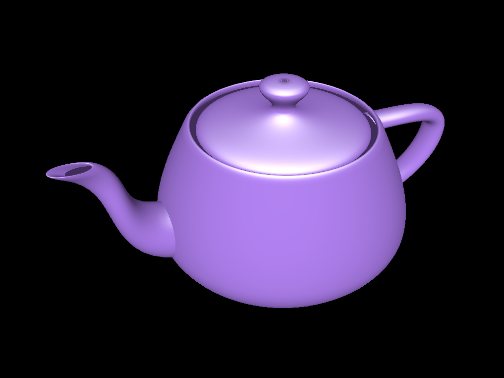

# teapot
This is a simple example of using [wgpu-rs](https://github.com/gfx-rs/wgpu-rs) to draw Gouraud shaded triangles.

This is [Martin Newell's teapot](https://en.wikipedia.org/wiki/Utah_teapot) which is defined as a set of 32
cubic [Bézier patches](https://en.wikipedia.org/wiki/B%C3%A9zier_surface). For details on the math, see
[this post](https://blogs.mathworks.com/graphics/2015/05/12/patch-work/) at my old Mathworks blog.

Teapot demo © 2020 RustyTriangles LLC
